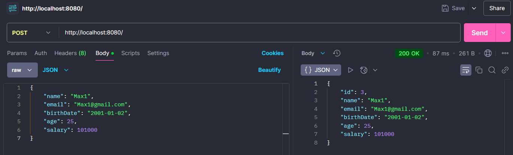

# Test Spring Boot App

## Stack:
- `Java`  21 version
- `Maven`  3.9.8 version
- `Spring`  3.3.5 version
- `Docker`  27.1.1 version

## Description:
This is the example application in Spring Boot with the basic concepts

Before run app need this command :

````
docker pull postgres
docker run --name spring-boot-postgres -p 5432:5432 -e POSTGRES_PASSWORD=root -d postgres
````

## Create new employee:



## TODO:
1) Add tests
2) Add more logic (more entities)
3) Rewrite/Remove `EmployeeConfig` where some users hardcoded.
4) Maybe add services , that could 
5) Add Docker file and refactor logic with database

## Useful resources:
- https://www.youtube.com/watch?v=mN0hf-r1XbI&t=5697s - initial code from here

## Author - Maxim Kalugin